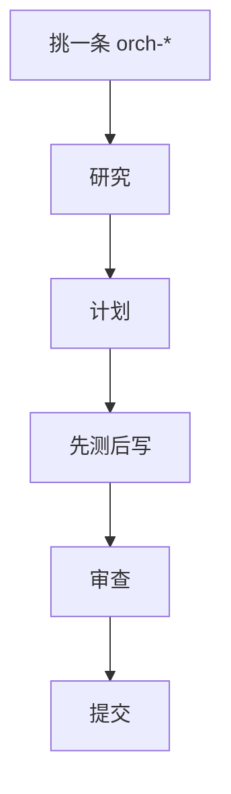

# 编排

按要做的事挑一条命令。它自己跑完阶段，不要另拼一套。

| 命令 | 干什么 |
|------|--------|
| `/orch-fix-defect` | 修缺陷 |
| `/orch-add-feature` | 加功能 |
| `/orch-change-feature` | 改功能 |
| `/orch-build-mvp` | 从零搭 MVP |
| `/orch-refine-code` | 收代码 |

主开发链（grilling → spec → plan → tdd → review）优先。这条给已经能说清任务类型的时候。
