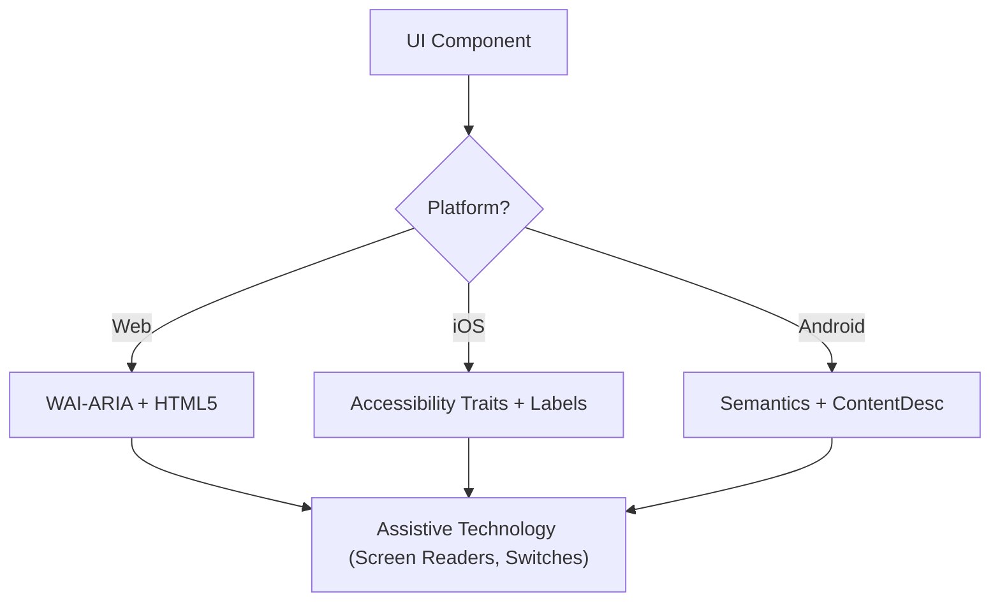

# 无障碍访问（WCAG 2.2）

此技能确保数字界面对所有用户而言都是可感知（Perceivable）、可操作（Operable）、可理解（Understandable）且健壮（Robust）的（POUR），包括使用屏幕阅读器、切换控制或键盘导航的用户。它专注于 WCAG 2.2 成功标准的技术实现。

## 何时使用

- 为 Web、iOS 或 Android 定义 UI 组件规范。
- 审计现有代码中存在的无障碍使用障碍或合规缺口。
- 实现 WCAG 2.2 的新标准，例如目标尺寸（最小值）和焦点外观。
- 将高层设计需求映射为技术属性（ARIA 角色、traits、hints）。

## 核心概念

- **POUR 原则**：WCAG 的基础（可感知、可操作、可理解、健壮）。
- **语义映射**：优先使用原生元素而非通用容器，以提供内置的无障碍支持。
- **无障碍树**：辅助技术实际“读取”的 UI 表示。
- **焦点管理**：控制键盘/屏幕阅读器光标的顺序与可见性。
- **标签与提示**：通过 `aria-label`、`accessibilityLabel` 和 `contentDescription` 提供上下文。

## 工作原理

### 步骤 1：确定组件角色

确定其功能用途（例如：这是按钮、链接还是选项卡？）。在诉诸自定义角色之前，应优先使用可用的语义化程度最高的原生元素。

### 步骤 2：定义可感知属性

- 确保文本对比度达到 **4.5:1**（普通文本）或 **3:1**（大字号/UI）。
- 为非文本内容（图片、图标）添加文本替代。
- 实现响应式重排（支持最高 400% 缩放而不损失功能）。

### 步骤 3：实现可操作控件

- 确保目标尺寸不小于 **24x24 CSS 像素**（WCAG 2.2 SC 2.5.8）。
- 验证所有交互元素均可通过键盘访问，并具有可见的焦点指示器（SC 2.4.11）。
- 为拖拽操作提供单指针替代方式。

### 步骤 4：确保逻辑可理解

- 使用一致的导航模式。
- 提供描述性的错误消息和更正建议（SC 3.3.3）。
- 实现“冗余录入”（Redundant Entry，SC 3.3.7），避免重复要求用户提供相同数据。

### 步骤 5：验证健壮兼容性

- 使用正确的 `Name, Role, Value` 模式。
- 为动态状态更新实现 `aria-live` 或实时区域（live regions）。

## 无障碍架构图



## 跨平台映射

| 功能               | Web（HTML/ARIA）         | iOS（SwiftUI）                       | Android（Compose）                                          |
| :----------------- | :----------------------- | :----------------------------------- | :---------------------------------------------------------- |
| **主标签**         | `aria-label` / `<label>` | `.accessibilityLabel()`              | `contentDescription`                                        |
| **辅助提示**       | `aria-describedby`       | `.accessibilityHint()`               | `Modifier.semantics { stateDescription = ... }`             |
| **操作角色**       | `role="button"`          | `.accessibilityAddTraits(.isButton)` | `Modifier.semantics { role = Role.Button }`                 |
| **实时更新**       | `aria-live="polite"`     | `.accessibilityLiveRegion(.polite)`  | `Modifier.semantics { liveRegion = LiveRegionMode.Polite }` |

## 示例

### Web：无障碍搜索

```html
<form role="search">
  <label for="search-input" class="sr-only">Search products</label>
  <input type="search" id="search-input" placeholder="Search..." />
  <button type="submit" aria-label="Submit Search">
    <svg aria-hidden="true">...</svg>
  </button>
</form>
```

### iOS：无障碍操作按钮

```swift
Button(action: deleteItem) {
    Image(systemName: "trash")
}
.accessibilityLabel("Delete item")
.accessibilityHint("Permanently removes this item from your list")
.accessibilityAddTraits(.isButton)
```

### Android：无障碍开关

```kotlin
Switch(
    checked = isEnabled,
    onCheckedChange = { onToggle() },
    modifier = Modifier.semantics {
        contentDescription = "Enable notifications"
    }
)
```

## 应避免的反模式

- **Div 按钮**：使用 `<div>` 或 `<span>` 处理点击事件，却不添加角色和键盘支持。
- **仅靠颜色传达含义**：_仅_通过颜色变化（例如把边框变红）来指示错误或状态。
- **未受约束的模态焦点**：模态框未捕获焦点，使键盘用户能够在模态框打开时浏览背景内容。焦点必须被_包含_在模态框内，_并且_可通过 `Escape` 键或明确的关闭按钮脱离（WCAG SC 2.1.2）。
- **冗余的替代文本**：在 alt 文本中写“图片：……”或“照片：……”之类的表述（屏幕阅读器已经会播报“图片”这一角色）。

## 最佳实践清单

- [ ] 交互元素达到 **24x24px**（Web）或 **44x44pt**（原生）的目标尺寸。
- [ ] 焦点指示器清晰可见且具有高对比度。
- [ ] 模态框打开时**包含焦点**，关闭时干净地释放焦点（通过 `Escape` 键或关闭按钮）。
- [ ] 下拉框和菜单在关闭时将焦点恢复到触发元素。
- [ ] 表单提供基于文本的错误建议。
- [ ] 所有仅含图标的按钮都带有描述性文本标签。
- [ ] 文本缩放时内容能够正确重排。

## 参考资料

- [WCAG 2.2 指南](https://www.w3.org/TR/WCAG22/)
- [WAI-ARIA 编写实践](https://www.w3.org/TR/wai-aria-practices/)
- [iOS 无障碍编程指南](https://developer.apple.com/documentation/accessibility)
- [iOS 人机界面指南 - 无障碍](https://developer.apple.com/design/human-interface-guidelines/accessibility)
- [Android 无障碍开发者指南](https://developer.android.com/guide/topics/ui/accessibility)

## 相关技能

- `frontend-patterns`
- `design-system`
- `liquid-glass-design`
- `swiftui-patterns`