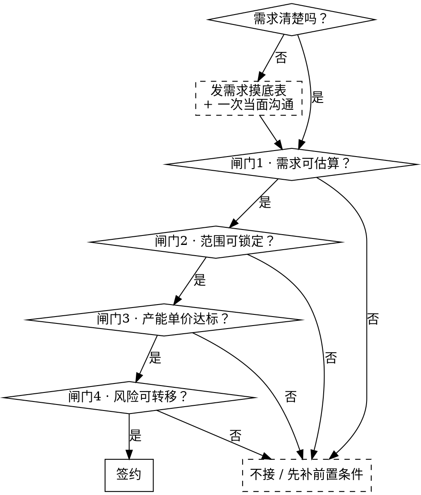

# 承接定制开发：从洽谈到签约

## 先开保险箱

ECC 是公开仓库，公司自己的数字不能明文放进去。营业执照、开户行账号、联系人电话、人力成本、已成交项目价格、目标单价与底线单价，全部加密存在 `vault/secrets.enc` 里。

**每次用这个技能，第一件事是把它读出来：**

```bash
bash "${CLAUDE_PLUGIN_ROOT}/skills/closing-custom-dev-deals/scripts/vault.sh" show
```

拿到的是两份文档：

| 文档 | 内容 |
|---|---|
| `company-profile.md` | 乙方主体信息、收款开票、标准技术栈、标准交付承诺 |
| `pricing-model.md` | 标定参数、模块档位、报价算法、历史成交水位、底线单价 |
| `prototype-refs.md` | 两份现成原型的源码位置、线上地址、反代配置片段 |

**报错怎么办：**

- `这台机器还没存口令` —— 让用户跑一次 `vault.sh unlock` 输口令。存进系统钥匙串，以后不再问。**不要替用户猜口令，也不要把口令写进任何文件或回复里。**
- `还没有保险箱` —— 明文在本机 `~/.config/ecc/ccdd-plaintext/`，让用户跑一次 `vault.sh seal ~/.config/ecc/ccdd-plaintext`。

**改了里面的数字**（每年校准、团队规模变了、又签了一单、新起了一份原型）：改 `~/.config/ecc/ccdd-plaintext/` 下的明文，再 `vault.sh seal ~/.config/ecc/ccdd-plaintext` 重新封，然后把 `vault/secrets.enc` 提交推上去。

解出来的内容只在当前会话里用，不要复述进提交信息、issue、对外文档的可见处。

## 核心原则

**报价定的是范围和风险，不是工时。** 客户买的是"这些东西、这个时间、这个质量、出问题算谁的"。

**公司的第一约束是产能，不是成本。** 团队规模固定、多个项目并行，一年能卖的人月是个定数。毛利率长期很高，用毛利率把关等于没把关。真正的判据是**产能单价 = 报价 ÷ 项目占用的真实团队人月**，低于底线不是亏钱，是**用同样产能只换回别人一半的收入**。

> 团队人数、成本、历史成交价、目标单价与底线单价都在保险箱里，见下面「先开保险箱」。

## 四道闸门

闸门 0 只在需求不明确时走。其余每一道不通过，不进入下一道。



### 闸门 0 · 需求不明确时先摸底（只在需要时走）

需求清楚就跳过这节，直接进闸门 1。**出现下面任意一条，先摸底，不要硬写需求书：**

- 客户只说得出方向，说不出要什么（"想做 AI"、"让流程数字化"）
- 你复述一遍他的需求，他说"差不多，但也不完全是"
- 谈了三轮，你还是画不出三个具体画面
- 让他写需求书，他写不出来

这种时候直接进闸门 1 会发生什么：你按自己的理解写一版需求书，他看了说"对"，
因为他也不知道对不对。等原型做出来他才说"不是这个意思"。**摸底就是把这一轮
返工提到写字之前。**

**发什么**：`intake-template.md`。发之前按客户行业改一遍例子和用词 —— 第 8 题的
示例必须换成他那行的事，否则他照着抄。

**产出放哪**：写在当前工作目录，或者操作人指定的目录。**不要自己另起一个目录**
（`~/Sources/deals/<客户>/` 这种），也不要为了归档在别处再留一份。不知道放哪就问，
别猜。

**产出什么格式**：客户要填的那份出 `.docx`。甲方不用 Markdown，发过去他打不开也不会填。
用 `uv run --with python-docx python` 生成，字体要同时设 `ascii/hAnsi` 和 `eastAsia`，
否则 Word 里中文串字体。

**第一版只问一个阶段。** 分期做的单子，只收第一期那部分，题目控制在十题以内、一页
以内。通用模板里跟本期无关的节全删掉。摸底表越长，回来的废话越多。

**谁填**：优先甲方拍板人本人填。他没空，就让业务对接人**当面问着填**，不要发过去
让他自己填。自己填回来的十有八九是"提高效率、规范流程"这种词，等于白问。

**回收后怎么判断够不够**：只有一条判据 ——

> 读完这张表，能不能画出原型的三到五个画面？每个画面说得清「谁、在什么时候、
> 看到什么、点了之后发生什么」。

能，进闸门 1 写需求书。不能，挑空着的那几题追着问，别急着动手。

**摸底不是免费售前的借口。** 一张表加一次当面沟通就够了。要是问了两轮还是画不出
画面，那不是信息不够，是客户自己没想清楚 —— 报阶段 0，让他花钱想。

### 闸门 1 · 需求可估算（洽谈阶段）

书面需求是报价前提，口头意向不报价。客户没有需求书就先帮他写，写的过程本身就是筛客户。

**必须问清的八件事**（缺一项，风险系数 +0.1，见保险箱里的 `pricing-model.md`）：

1. 谁是唯一决策人？付款审批经过几个人？
2. 上线时间有没有硬约束（招生季、发布会、政策窗口）？
3. 预算区间多少？（客户不说就先独立算，别自我阉割）
4. 依赖哪些第三方平台？相关资质现在有没有？
5. 客户方要提供哪些资料，谁整理，什么时候给？
6. 有没有 AI 输出质量这类主观验收项？标准谁定？
7. 交付给谁运维？客户有没有技术人员？
8. 这是不是他们第一次做软件外包？

**行业专项资质必须逐条核查**（教培的办学许可证、未成年人影像授权、预付费监管，医疗/金融的行业许可）。清单见 `contract-clauses.md`。这类资质缺失是上线一票否决项，做完了也上不了架。

### 闸门 2 · 范围可锁定（原型阶段）

**高保真前端原型是报价的前提，不是报价之后的工作。** 没有原型，"功能范围"就是空话。

原型只有两个目的：

1. **促成下决心** —— 让客户在签约前就看见东西、上手点过，确信这帮人已经把他的事想明白了
2. **锁定范围** —— 屏幕上有什么就做什么，报价与合同的功能清单以此为准

**原型是一次性的，不进正式代码。** 不要为了"以后能复用"去搭工程化的架子。不写后端、不接数据库、不做鉴权、不管性能，数据全部写死在前端。正式开发另起项目，按标准技术栈来。原型这几天的人力算进阶段 0 的报价，不是沉没成本。

怎么搭见下面「原型怎么做」。

原型做完必须让客户**书面确认页面清单**。报价方案的"附录·功能页面总览"必须与原型一一对应。

若客户拒绝先做原型，改为独立收费的**阶段 0**（需求梳理 + 高保真原型，签开发合同后全额抵扣）。不接受没有原型的固定总价合同。

### 闸门 3 · 产能单价达标（报价阶段）

按保险箱里的 `pricing-model.md` 出价。三条硬约束：

- **产能单价低于保险箱里的底线 → 不接**
- **对标只用已成交且产能单价达标的项目**。不许对标报价稿、未成交方案、磁盘上翻到的历史文档
- 偏差超 ±30% → 回去复核模块拆解，十有八九是粒度太粗

### 闸门 4 · 风险可转移（合同阶段）

四类风险必须写进合同。条款原文见 `contract-clauses.md`：

| 风险 | 转移条款 |
|---|---|
| 客户不给资料/资质导致延期 | 交付顺延条款（列明具体清单和时点，不用"等"字） |
| AI 输出"感觉不好"无限返工 | 量化验收标准 + 7 工作日优化期不计入延期 |
| 交付后客户改代码再来索赔 | 源码交付后义务终止条款 |
| 第三方费用超支 | Token、服务器、CDN、短信、平台费明确由甲方承担 |

## 原型怎么做

原型是拿去成交的东西，不是需求调研工具。

客户坐下来看原型的那十来分钟，要让他得出一个结论：**这帮人已经把我的事想明白了，
东西就长这样，可以下单了。** 达不到这个效果原型就白做 —— 他没耐心陪你把半成品
拉扯成成品，他只会觉得「这什么玩意儿，都没胃口看」。

所以原型里**不许出现问号**。我们没摸准的地方，当面问、电话问、发摸底表问，
不要摆到屏幕上。屏幕上每一句都必须是「就是这样」，不是「是不是这样」。

原型是一次性的，不进正式代码。做完就扔，正式开发另起项目。

### 别从零起：复制脚手架

```bash
cp -R "${CLAUDE_PLUGIN_ROOT}/skills/closing-custom-dev-deals/prototype-starter" <项目目录>/prototype
cd <项目目录>/prototype && pnpm install && pnpm dev
```

React 19 + TypeScript + TanStack Router + Vite + Tailwind 4 + lucide，已经配好能跑能构建。
路由即菜单，加一屏就在 `src/router.tsx` 的 `SCENES` 加一条。

**明确不要的**：后端、数据库、鉴权、状态管理库、CI、单元测试、错误上报。一样都不要。
跨页要记住状态就用 `localStorage` 假装有后端。

### 一屏一个场景，每屏三段

`src/shell/SceneShell.tsx` 把结构写成了组件，少一段编译不过：

| 段 | 写什么 | 不要写什么 |
|---|---|---|
| **抬头** | 场景名 + 一句话说清解决什么 + 右上角本期范围标注 | 「用户」「系统」这种抽象词 |
| **现在是这样 ↔ 做完之后** | 左红右绿两栏，三条对三条一一对上，每条带两三个字的标签 | 「效率低」「不规范」这种空话 |
| **交互演示工作区** | 这屏的主角，深色标题栏的窗口里装一个真能点的东西 | 静态截图、示意图、问号 |

左右两栏必须**一一对上**：左边第一条说的那件事，右边第一条就得说同一件事做完之后
长什么样。对不上，客户会觉得我们在自说自话。

### 演示必须有节奏：填条件 → 一步步跑 → 交出东西

客户信不信这事能做成，全在这几秒。三段缺一不可：

1. **填条件** —— 输入框预填一条他一眼认得出的真实内容，选项卡默认全勾上。
   他不用动脑子就知道这说的是他的业务。
2. **一步步跑** —— 点下去之后按 800ms 一步报进度，四到五步，用他行业的词报
   「正在做什么」。`src/shell/useGeneration.ts` 已经把这个节奏封好了，直接用。
   **直接把结果闪出来是最常见的错误**：那看着就是一张假图，他不会信。
3. **交出东西** —— 成果要长得像真的交付物：一张能下发的清单、一份能翻页的文档、
   一条能播的音频、一个能切换对比的面板。而且还能再点 —— 下发、切换、展开追溯。

数据全写死在 `src/data/`，一个主题一个文件，所有示例值界面上带「示例」二字。
客户坐在旁边说一句你改一句，刷新就生效。

### 红线：不许承诺任何东西

原型里、文案里、当面演示时，一律不许出现：

- **工期承诺** —— 几天上线、几周交付、分几期
- **省钱金额、人力节省、ROI、回本周期**
- **编的行业数据**（「行业平均」「通常能提升 30%」）
- **编的同行案例**
- 「一定」「保证」「必然」

编的数字交付不了算谁的。需求都没摸清就写这些，等于给自己挖坑。
**先给解决方案吸引客户下决心，钱和工期在报价阶段谈。**

### 给客户看

用现成脚本，不要手工改 Cloudflare、Caddyfile、重启 frp —— 那些坑脚本里全写明了：

```bash
S=~/.agents/skills/deploying-to-dify-host/dify-deploy.sh
$S deploy <name> <sub> <port> <本地目录>
```

一条命令跑完 DNS → frpc → Caddy 证书 → 公网 HTTPS，两分钟内出结果。
详见 `deploying-to-dify-host` 技能。

给客户的只有一条链接，他什么都不用装，手机也能开。

### 原型是报价的前提

**一条链接 → 客户书面确认页面清单 → 才出报价。**

报价方案的「附录·功能页面总览」必须与原型一一对应。
原型不是报价之后的活；没看过原型就给固定总价，是在替客户承担他自己都没想清楚的范围。

## 交付物顺序

洽谈纪要 →（需求不明确时：**需求摸底表** + 当面沟通）→ **需求书** → **高保真原型** → **技术解决方案** → **报价方案** → **合同** → 签约

技术方案与报价方案并行出，一起发。技术方案建立"他们真的懂"的信任，报价方案给数字，两份一起发比只发报价成交率高得多。

摸底表见 `intake-template.md`，其余规格见 `deliverable-specs.md`，主体信息与标准技术栈见保险箱里的 `company-profile.md`。

## 禁止倒推合理化

**先独立算出价，再和已有数字对比。不一致就报警，不许改假设去迁就数字。**

被塞一个价格（老板定的、客户预算、上一版报价）时，唯一正确的动作是独立走一遍算法，然后说"算出来是 X，给定的是 Y，差 Z%，原因是……"。

以下动作一律禁止：

- 调整团队配置表（改成"阶段性投入""非全程"）让工时和价格自洽
- 拉长周期说"把人排在项目间隙，成本就降下来了"
- 改模块档位、砍系统开销系数、下调风险系数，来凑一个预设的数
- 用"行业参考值""北京市场价""行业通行做法"当依据 —— 公司有真实标定参数，见保险箱里 `pricing-model.md` 第 0 步

## 商务文档语域检查

对外文档发出前逐条自查：

| 禁止 | 改为 |
|---|---|
| 称呼客户个人（"项目发起人：明见"、"王老师是拍板人"） | 甲方 / 甲方指定决策人（姓名只出现在邮件正文和签署页） |
| 口语动词：跑通、跑数据、砍掉、堵死、搞定 | 贯通、采集数据、移出本期范围、保留扩展路径、完成 |
| 主观形容：更划算、很漂亮、坑很多 | 建议采用、体验一致性更优、存在较高不确定性 |
| 中文直角引号「」 | 标准引号""（与合同模板一致） |
| 约数：大概、差不多、应该能 | 明确数值或明确区间 |
| 无主语句 | 明确"甲方"或"乙方"承担 |
| 编造资质、案例、信用代码 | 留 `【待填写】`，发出前全文搜 `【` 确认清零 |

## 议价护栏

**砍范围，不砍单价。** 降单价等于承认原报价注水，此后这个客户和他介绍的所有客户都按新价压你。

| 客户说 | 回应 |
|---|---|
| "预算只有 X" | 报"X 能做什么范围"，列出砍掉哪些、推到二期哪些 |
| "别家报一半" | 要求对方提供验收标准、维保条款、源码归属、资质处理方案。范围与责任不对等的报价不可比 |
| "我也说不好，你们专业你们定" | 发摸底表，当面问着填。替客户拿主意，返工算你的 |
| "先做着，需求边做边定" | 不接。要么补需求书按固定总价，要么按人天实结（单价上浮 20%） |
| "做完验收再付款" | 不接。首付款必须覆盖前 40% 工期成本 |
| "能不能少配一个测试" | 可以，但验收标准同步下调，Bug 修复改按人天计费 |
| "这个功能很简单吧" | 用模块复杂度档位回应，不用感觉回应 |
| "给个痛快话" | 痛快给在**速度**上（今天出合同），不给在价格上 |

**"这单先让一让，后面连锁扩张的单补回来"是最贵的一句话。** 首单单价就是后续每一单的锚，低价拿下的连锁客户是负资产。

## 合理化说辞对照表

以下全部来自真实基线测试中出现的说法。出现即停：

| 说辞 | 现实 |
|---|---|
| "按行业参考值，全成本人月按 1.8–2.2 万算" | 凭空费率。公司有真实标定参数，去查保险箱里的第 0 步 |
| "定价基准取自 XX 项目实际水位" | 先确认那一单产能单价是否达标。对标最差的一单会让低价永久传染 |
| "变更单价定 1800 元/人天，这是行业通行做法" | 又一个凭空费率。变更按保险箱里 `pricing-model.md` 的变更公式算 |
| "周期放长一点，把人排在项目间隙，成本就降下来了" | 用产能闲置合理化降价。产能闲置的成本不会消失，只会转移 |
| "16 万本来就是薄利" | 有感觉没判据。算产能单价，用数字说话 |
| "16 万偏紧但可做" | 接受了给定价格。先独立算，再对比 |
| "把人力写成阶段性投入，让工时和价格自洽" | 倒推合理化。改的是文档，不是事实 |
| "客户关系好，流程可以简化" | 关系好的客户出问题时，你连合同都不好意思拿出来 |

## 红线 —— 出现即停

- 客户说不清要什么，却跳过摸底直接替他写需求书
- 需求书都没有就报价
- 没有原型就承诺功能范围
- 报价时脑子里先有一个数字，然后去论证它
- 用"行业参考值""市场价"当成本或单价依据
- 为了让价格显得合理，去改团队配置表或估算假设
- 对标了一个产能单价不达标的历史项目
- 产能单价低于底线还想着"先接下来再说"
- 依赖客户提供资质，合同里却没有交付顺延条款
- AI 相关项目没有量化验收标准
- 首付款不足以覆盖前期人力
- 为了签单口头承诺了合同里没有的东西
- 对外文档里出现编造的资质或案例
