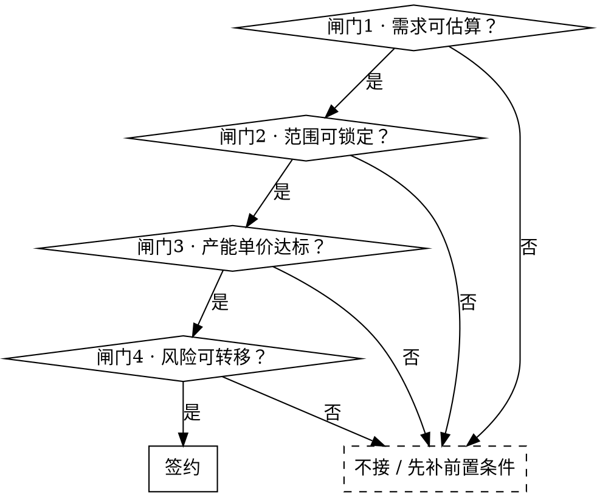

# 承接定制开发：从洽谈到签约

## 先开保险箱

ECC 是公开仓库，公司自己的数字不能明文放进去。营业执照、开户行账号、联系人电话、人力成本、已成交项目价格、目标单价与底线单价，全部加密存在 `vault/secrets.enc` 里。

**每次用这个技能，第一件事是把它读出来：**

```bash
bash "${CLAUDE_PLUGIN_ROOT}/skills/closing-custom-dev-deals/scripts/vault.sh" show
```

拿到的是两份文档：

| 文档 | 内容 |
|---|---|
| `company-profile.md` | 乙方主体信息、收款开票、标准技术栈、标准交付承诺 |
| `pricing-model.md` | 标定参数、模块档位、报价算法、历史成交水位、底线单价 |

**报错怎么办：**

- `这台机器还没存口令` —— 让用户跑一次 `vault.sh unlock` 输口令。存进系统钥匙串，以后不再问。**不要替用户猜口令，也不要把口令写进任何文件或回复里。**
- `还没有保险箱` —— 明文还在本机 `~/.claude/skills/closing-custom-dev-deals/`，让用户跑一次 `vault.sh seal ~/.claude/skills/closing-custom-dev-deals`。

**改了里面的数字**（每年校准、团队规模变了、又签了一单）：改本机明文，再 `vault.sh seal` 重新封，然后把 `vault/secrets.enc` 提交推上去。

解出来的内容只在当前会话里用，不要复述进提交信息、issue、对外文档的可见处。

## 核心原则

**报价定的是范围和风险，不是工时。** 客户买的是"这些东西、这个时间、这个质量、出问题算谁的"。

**公司的第一约束是产能，不是成本。** 团队规模固定、多个项目并行，一年能卖的人月是个定数。毛利率长期很高，用毛利率把关等于没把关。真正的判据是**产能单价 = 报价 ÷ 项目占用的真实团队人月**，低于底线不是亏钱，是**用同样产能只换回别人一半的收入**。

> 团队人数、成本、历史成交价、目标单价与底线单价都在保险箱里，见下面「先开保险箱」。

## 四道闸门

每一道不通过，不进入下一道。



### 闸门 1 · 需求可估算（洽谈阶段）

书面需求是报价前提，口头意向不报价。客户没有需求书就先帮他写，写的过程本身就是筛客户。

**必须问清的八件事**（缺一项，风险系数 +0.1，见保险箱里的 `pricing-model.md`）：

1. 谁是唯一决策人？付款审批经过几个人？
2. 上线时间有没有硬约束（招生季、发布会、政策窗口）？
3. 预算区间多少？（客户不说就先独立算，别自我阉割）
4. 依赖哪些第三方平台？相关资质现在有没有？
5. 客户方要提供哪些资料，谁整理，什么时候给？
6. 有没有 AI 输出质量这类主观验收项？标准谁定？
7. 交付给谁运维？客户有没有技术人员？
8. 这是不是他们第一次做软件外包？

**行业专项资质必须逐条核查**（教培的办学许可证、未成年人影像授权、预付费监管，医疗/金融的行业许可）。清单见 `contract-clauses.md`。这类资质缺失是上线一票否决项，做完了也上不了架。

### 闸门 2 · 范围可锁定（原型阶段）

**高保真前端原型是报价的前提，不是报价之后的工作。** 没有原型，"功能范围"就是空话。

1. 把口头需求变成客户能指着屏幕确认的页面 —— 范围锁定的唯一可靠手段
2. 客户签约前就看到东西，显著提高成交率
3. 原型代码可直接演进为正式代码，不是沉没成本

原型做完必须让客户**书面确认页面清单**。报价方案的"附录·功能页面总览"必须与原型一一对应。

若客户拒绝先做原型，改为独立收费的**阶段 0**（需求梳理 + 高保真原型，签开发合同后全额抵扣）。不接受没有原型的固定总价合同。

### 闸门 3 · 产能单价达标（报价阶段）

按保险箱里的 `pricing-model.md` 出价。三条硬约束：

- **产能单价低于保险箱里的底线 → 不接**
- **对标只用已成交且产能单价达标的项目**。不许对标报价稿、未成交方案、磁盘上翻到的历史文档
- 偏差超 ±30% → 回去复核模块拆解，十有八九是粒度太粗

### 闸门 4 · 风险可转移（合同阶段）

四类风险必须写进合同。条款原文见 `contract-clauses.md`：

| 风险 | 转移条款 |
|---|---|
| 客户不给资料/资质导致延期 | 交付顺延条款（列明具体清单和时点，不用"等"字） |
| AI 输出"感觉不好"无限返工 | 量化验收标准 + 7 工作日优化期不计入延期 |
| 交付后客户改代码再来索赔 | 源码交付后义务终止条款 |
| 第三方费用超支 | Token、服务器、CDN、短信、平台费明确由甲方承担 |

## 交付物顺序

洽谈纪要 → **需求书** → **高保真原型** → **技术解决方案** → **报价方案** → **合同** → 签约

技术方案与报价方案并行出，一起发。技术方案建立"他们真的懂"的信任，报价方案给数字，两份一起发比只发报价成交率高得多。

规格见 `deliverable-specs.md`，主体信息与标准技术栈见保险箱里的 `company-profile.md`。

## 禁止倒推合理化

**先独立算出价，再和已有数字对比。不一致就报警，不许改假设去迁就数字。**

被塞一个价格（老板定的、客户预算、上一版报价）时，唯一正确的动作是独立走一遍算法，然后说"算出来是 X，给定的是 Y，差 Z%，原因是……"。

以下动作一律禁止：

- 调整团队配置表（改成"阶段性投入""非全程"）让工时和价格自洽
- 拉长周期说"把人排在项目间隙，成本就降下来了"
- 改模块档位、砍系统开销系数、下调风险系数，来凑一个预设的数
- 用"行业参考值""北京市场价""行业通行做法"当依据 —— 公司有真实标定参数，见保险箱里 `pricing-model.md` 第 0 步

## 商务文档语域检查

对外文档发出前逐条自查：

| 禁止 | 改为 |
|---|---|
| 称呼客户个人（"项目发起人：明见"、"王老师是拍板人"） | 甲方 / 甲方指定决策人（姓名只出现在邮件正文和签署页） |
| 口语动词：跑通、跑数据、砍掉、堵死、搞定 | 贯通、采集数据、移出本期范围、保留扩展路径、完成 |
| 主观形容：更划算、很漂亮、坑很多 | 建议采用、体验一致性更优、存在较高不确定性 |
| 中文直角引号「」 | 标准引号""（与合同模板一致） |
| 约数：大概、差不多、应该能 | 明确数值或明确区间 |
| 无主语句 | 明确"甲方"或"乙方"承担 |
| 编造资质、案例、信用代码 | 留 `【待填写】`，发出前全文搜 `【` 确认清零 |

## 议价护栏

**砍范围，不砍单价。** 降单价等于承认原报价注水，此后这个客户和他介绍的所有客户都按新价压你。

| 客户说 | 回应 |
|---|---|
| "预算只有 X" | 报"X 能做什么范围"，列出砍掉哪些、推到二期哪些 |
| "别家报一半" | 要求对方提供验收标准、维保条款、源码归属、资质处理方案。范围与责任不对等的报价不可比 |
| "先做着，需求边做边定" | 不接。要么补需求书按固定总价，要么按人天实结（单价上浮 20%） |
| "做完验收再付款" | 不接。首付款必须覆盖前 40% 工期成本 |
| "能不能少配一个测试" | 可以，但验收标准同步下调，Bug 修复改按人天计费 |
| "这个功能很简单吧" | 用模块复杂度档位回应，不用感觉回应 |
| "给个痛快话" | 痛快给在**速度**上（今天出合同），不给在价格上 |

**"这单先让一让，后面连锁扩张的单补回来"是最贵的一句话。** 首单单价就是后续每一单的锚，低价拿下的连锁客户是负资产。

## 合理化说辞对照表

以下全部来自真实基线测试中出现的说法。出现即停：

| 说辞 | 现实 |
|---|---|
| "按行业参考值，全成本人月按 1.8–2.2 万算" | 凭空费率。公司有真实标定参数，去查保险箱里的第 0 步 |
| "定价基准取自 XX 项目实际水位" | 先确认那一单产能单价是否达标。对标最差的一单会让低价永久传染 |
| "变更单价定 1800 元/人天，这是行业通行做法" | 又一个凭空费率。变更按保险箱里 `pricing-model.md` 的变更公式算 |
| "周期放长一点，把人排在项目间隙，成本就降下来了" | 用产能闲置合理化降价。产能闲置的成本不会消失，只会转移 |
| "16 万本来就是薄利" | 有感觉没判据。算产能单价，用数字说话 |
| "16 万偏紧但可做" | 接受了给定价格。先独立算，再对比 |
| "把人力写成阶段性投入，让工时和价格自洽" | 倒推合理化。改的是文档，不是事实 |
| "客户关系好，流程可以简化" | 关系好的客户出问题时，你连合同都不好意思拿出来 |

## 红线 —— 出现即停

- 需求书都没有就报价
- 没有原型就承诺功能范围
- 报价时脑子里先有一个数字，然后去论证它
- 用"行业参考值""市场价"当成本或单价依据
- 为了让价格显得合理，去改团队配置表或估算假设
- 对标了一个产能单价不达标的历史项目
- 产能单价低于底线还想着"先接下来再说"
- 依赖客户提供资质，合同里却没有交付顺延条款
- AI 相关项目没有量化验收标准
- 首付款不足以覆盖前期人力
- 为了签单口头承诺了合同里没有的东西
- 对外文档里出现编造的资质或案例
