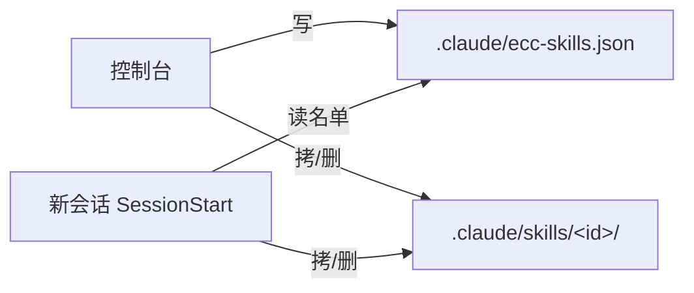

# Spec

Write the design spec. Stop before the implementation plan.

Chain: `grilling` → **spec** → `writing-plans` → `tdd-workflow` → `/code-review`

**Announce at start:** using spec to write the design.

## Gate

No confirmed grilling consensus this session → follow `grilling` and stop.

Consensus exists → do not re-ask settled decisions.

## Drop path

`.claude/specs/<stem>.md`

`<stem>` is a short kebab of the **feature** (what it does). The matching plan is `.claude/plans/<stem>.md`. Never put `spec` or `plan` in the stem — the folder already says that. Bad: `console-spec-plan.md`, `console-artifacts.plan.md`. Good: `console-artifacts.md`.

Create `.claude/specs/` if needed. Do not commit unless the user asks. Stay in `.claude/`, not `docs/`.

## Language

**The spec file is written in the user's language** — title, meta labels, every heading, and the prose. The headings below are the canonical structure, not literal strings to copy. A user writing 中文 who gets `Problem` / `Goals` / `Architecture` headings is a bug; translate them.

## What to write

Explore the repo first. Then one spec. YAGNI.

````markdown
# <Title>

- Date: YYYY-MM-DD
- Status: draft
- Source: the consensus reached this session

## Problem

Who hurts. What the code does today. Cost of leaving it.

## Goals and non-goals

**Goals**
- observable outcomes

**Non-goals**
- what we are not building, and why

## Decisions

| # | Decision | Choice | Why |
|---|----------|--------|-----|
| 1 | | | |

## Architecture

How the pieces fit, as a **mermaid diagram**. Not ASCII art — arrows and boxes drawn with `─` `→` `|` do not render, do not survive editing, and misalign the moment a label changes. The console and most markdown viewers render mermaid.

Pick the form that matches what you are showing:

- `flowchart LR` / `TD` — components, data flow, who writes what
- `sequenceDiagram` — an ordered interaction across processes or sessions
- `stateDiagram-v2` — a lifecycle with states and transitions

Node labels use the user's language. Paths, filenames, and identifiers stay verbatim.



Add a second diagram only when one genuinely cannot carry both concerns. Do not list which files to edit — that belongs in the plan.

## Data and interfaces

Tables, types, payloads. Exact names.

## Error handling

Failure modes and what the caller sees.

## Testing

What a failing test looks like for the main behaviors. No task list.

## Open questions

Must be empty before `/plan`. Decide with the user, or cut it from scope.
````

No TBD, TODO, or "handle later". If unknown, decide or cut.

## Self-review

Placeholders, contradictions, one-plan scope, ambiguity. Fix inline.

Then:

> Spec written to `<path>`. Read it. Say what to change, or say it is good. Next is `/plan <path>`.

Wait. Flip Status to approved only after they say so. Next skill is only `writing-plans`.
